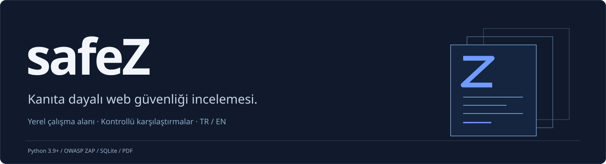
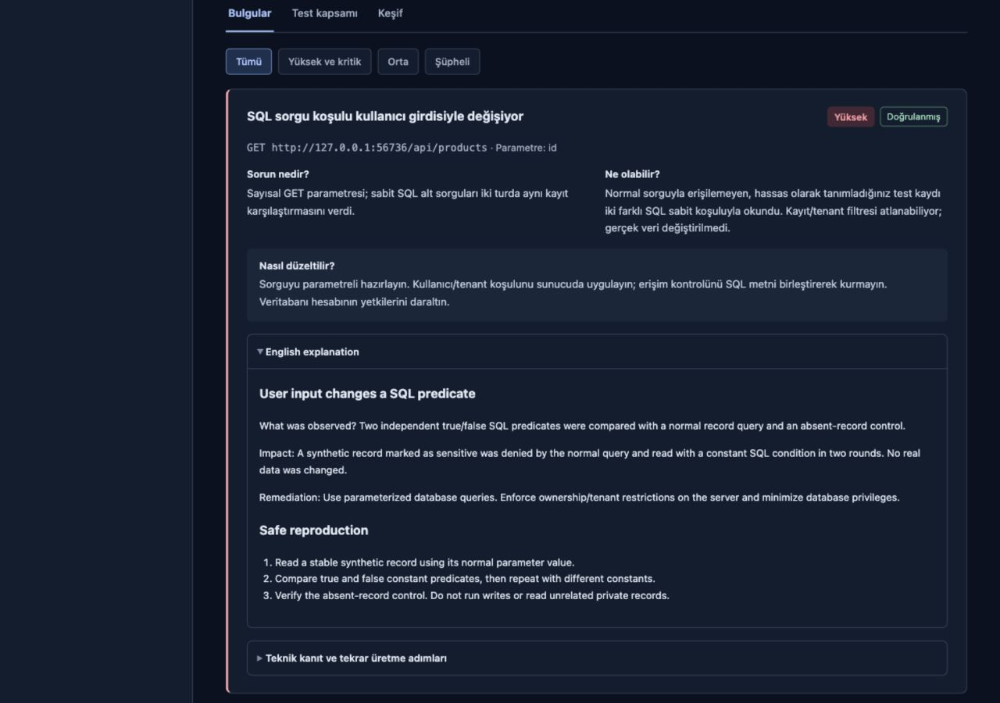
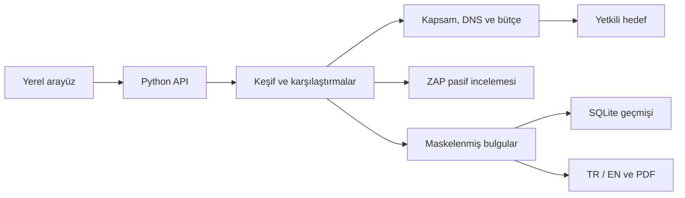

<div align="center">
  
  <br /><br />
  
  
  
  <p><a href="#baslangic">Kurulum</a> &nbsp;·&nbsp; <a href="#kapsam">Kapsam</a> &nbsp;·&nbsp; <a href="#mimari">Mimari</a> &nbsp;·&nbsp; <a href="#gelistirme">Geliştirme</a> &nbsp;·&nbsp; <a href="docs/SCANNING.md">Dokümantasyon</a></p>
</div>

## Genel bakış

**safeZ**, yetkili web güvenliği incelemeleri için geliştirilen yerel bir çalışma alanıdır. Bir domain veya URL üzerinden erişilebilir test noktalarını keşfeder, kontrollü yanıt karşılaştırmaları yapar ve bulguları konum, teknik kanıt, etki ve düzeltme adımlarıyla raporlar.

Sonuç modeli üç bilgiyi birlikte sunar: **ne gözlendiği**, **nasıl doğrulandığı** ve **hangi kontrollerin tamamlanmadığı**. Türkçe/İngilizce açıklamalar ve PDF çıktıları, teknik bulguların geliştirme ekipleriyle paylaşılmasını kolaylaştırır.

| Keşif | Karşılaştırma | Raporlama |
| :--- | :--- | :--- |
| HTML bağlantıları, GET formları, statik JavaScript API adresleri ve sitemap. | Normal yanıt, kontrollü girdi ve negatif örnekler; uygun senaryolarda iki tekrar turu. | Etkilenen adres/parametre, maskelenmiş kanıt, önem derecesi ve düzeltme adımları. |

### Uygulamadan bir görünüm

[](docs/assets/safez-lab-report.png)

<sub>Yerel, yapay verili laboratuvardan gerçek bir sonuç ekranı. Görsel; bulgu konumunu, etki değerlendirmesini ve iki dilli düzeltme açıklamasını gösterir.</sub>

<a id="baslangic"></a>

## Kurulum ve başlangıç

**Desteklenen ortam:** macOS veya Linux · **Python:** 3.9+ · **İlk kurulum:** internet bağlantısı.

Proje klasöründe:

```sh
chmod +x start.sh "safeZ Başlat.command" "safeZ Durdur.command"
./start.sh
```

Uygulama **http://127.0.0.1:8787** adresinde açılır. Başlangıç, ReportLab bağımlılığını ve pasif motor için gerekli ZAP/Java 21 ortamını hazırlar. Motor indirmeleri resmi kaynaklardan yapılır ve SHA-256 ile denetlenir. Docker gerekmez.

**macOS kısayolları:** `safeZ Başlat.command` uygulama ve motoru açar; `safeZ Durdur.command` aynı başlatıcının açtığı süreçleri kapatır. Kısayolları proje klasöründe tutun. Terminalden başlatılan uygulama `Ctrl+C` ile kapanır; kayıtlar korunur.

<details>
<summary><strong>Başlangıç seçenekleri</strong></summary>

| Amaç | Komut |
| :--- | :--- |
| Farklı arayüz portu, otomatik laboratuvar portları | `./start.sh --port 8788 --lab-ports 0 0` |
| ZAP olmadan karşılaştırmalı çekirdek | `./start.sh --no-zap` |
| Ayrı yerel kayıt dizini | `./start.sh --data-dir ./private-data` |

Varsayılan terminal başlangıcı için 8787, 9121 ve 9122 portlarının boş olması gerekir. macOS kısayolu uygun portları seçer. Motorsuz çalışma raporda açıkça belirtilir.

</details>

### İlk tarama

1. **Açık hedefi tara** ile yerel laboratuvarda inceleme başlatın.
2. Bulgunun adresini, karşılaştırmalarını ve düzeltme önerisini inceleyin.
3. **Düzeltilmiş hedefi tara** ile aynı kontrollerin olumsuz örneğini çalıştırın.

Laboratuvarın beklenen sonucu açık sürümde **3 doğrulanmış yüksek bulgu**, düzeltilmiş sürümde **0 doğrulanmış bulgu**dur. Bunlar yalnızca laboratuvar senaryolarının sonuçlarıdır; pasif uyarılar ayrı değerlendirilir.

Kendi hedefiniz için domain veya URL girip **Taramayı başlat** düğmesini kullanın. Şema yazılmazsa HTTPS seçilir. Hesap gerektiren kontrollerin kurulumu [kullanım rehberinde](docs/SCANNING.md) açıklanır.

<a id="kapsam"></a>

## Desteklenen kontroller

| Kontrol | Yöntem | Doğrulama sınırı |
| :--- | :--- | :--- |
| **SQL enjeksiyonu** | Sayısal JSON / metin parametrelerinde kararlı kayıt karşılaştırmaları. | Hata mesajı ve yanıt uzunluğu tek başına kanıt değildir. |
| **NoSQL operatör davranışı** | Skaler, `$eq`, `$ne` ve bulunmayan kayıt karşılaştırması. | Operatör kabulü şüpheli kalır; özel veri erişimi kanıtlanmaz. |
| **Sunucu tarafı şablon ifadesi** | İki zararsız aritmetik ifade ve negatif kontroller. | İfade değerlendirmesi, işletim sistemi komutu yürütme kanıtı değildir. |
| **HTML yansıması** | Zararsız özel öğe ve düz metin karşılaştırması. | JavaScript yürütmesi, kalıcılık ve ayrıcalıklı XSS doğrulanmaz. |
| **Açık yapılandırma** | Yapılandırma dosyaları, bulunmayan dosya kontrolü ve tekrar okuma. | Sırların kullanılabilirliği denenmez; değerleri kaydedilmez. |
| **Depo üst bilgisi** | `/.git/HEAD` yanıtı ve tekrar kontrolü. | Kaynak kodu veya depo nesneleri indirilmez. |
| **BOLA** | A/B kimlikleri, sahip olunan kayıtlar ve A → B erişimi. | İki test hesabı, kimlik ucu ve ayrı özel kayıtlar gerekir. |
| **Anonim özel veri erişimi** | Geçerli, anonim ve geçersiz oturum karşılaştırması. | Bir geçerli test hesabı ve bilinen özel kayıt gerekir. |
| **Pasif ZAP incelemesi** | Keşifte alınmış anonim yanıtların HAR üzerinden incelenmesi. | Aktif tarama/spider çalışmaz; uyarılar şüpheli gösterilir. |

**Sonuçların yorumu:** Doğrulanmış bulgular ile şüpheli gözlemler ayrı tutulur. “Test edildi”, yalnızca belirtilen senaryonun çalıştığını ifade eder. Eksik girdi, erken durdurma ve uygulanmamış kontroller raporda görünür.

<details>
<summary><strong>Mevcut ürün sınırları</strong></summary>

safeZ geliştirme aşamasındadır. İşletim sistemi komut enjeksiyonu, keyfi dosya okuma/yazma/yükleme, doğrulayıcı servisle SSRF, kalıcı/ayrıcalıklı XSS, sır kullanılabilirliği, yönetici/işlev düzeyi yetki, iş mantığı, parola sıfırlama ve oturum yaşam döngüsü senaryoları uygulanmamıştır.

Hesaplar arası yetki ve özel veri erişimi, gerekli test hesapları/senaryoları olmadan doğrulanamaz. Kapsamlı pentest veya tüm açıkların bulunması garanti edilmez; açık bulunmaması güvenli site anlamına gelmez.

</details>

### Çalışma sınırları

| Hız | Toplam istek | Keşif | Yanıt boyutu | DNS / HTTP |
| :---: | :---: | :---: | :---: | :---: |
| **2 istek/sn** | **240** | **32 istek** | **256 KiB** | **6 saniye** |

Kapsam tek origin ile sınırlıdır. DNS/IP denetimi, bağlantı adresini sabitleme, yönlendirme sınırları ve iptal uygulanır. Otomatik kontroller GET kullanır; POST, yazma veya silme işlemi göndermez. Bir GET ucunun gerçekten salt okunur olması hedef uygulamanın sorumluluğudur.

<a id="mimari"></a>

## Mimari



| Bileşen | Sorumluluk |
| :--- | :--- |
| `app.py` / `run.py` / `launcher.py` | Yerel API, iş yönetimi ve süreç yaşam döngüsü. |
| `kanit/discovery.py` / `checks.py` / `engine.py` | Keşif, kontrollü testler ve kanıt değerlendirmesi. |
| `kanit/scope.py` / `zap.py` | Ağ kapsamı ve pasif motor bağlantısı. |
| `kanit/store.py` / `report.py` / `explanations.py` | Kayıt, PDF ve iki dilli açıklamalar. |
| `web/` / `assets/` / `tests/` | Arayüz, PDF fontları ve kabul/regresyon testleri. |

Sunucu Python standart kütüphanesini, arayüz HTML/CSS/JavaScript'i kullanır. Kayıtlar SQLite'ta, PDF'ler ReportLab ve Noto Sans ile üretilir. İç Python paketinin `kanit` adı uyumluluk için korunur.

## Veri yönetimi

- **Oturumlar:** çerez/bearer değerleri tarama sırasında bellekte tutulur; rapora kaydedilmez.
- **Kanıtlar:** özgün yanıt gövdeleri yerine maskelenmiş istek bilgisi, HTTP durumu, boyut, hash ve işaretleyici var/yok bilgisi saklanır.
- **Konum:** adres, parametre, keşif kaynağı ve varsa HTTP yanıt satırı bildirilir. Sunucu kaynak kodunun satırı HTTP taramasından belirlenemez.
- **Yerel kayıtlar:** terminal başlangıcında `work/data/kanit.db`; macOS kısayolunda `~/Library/Application Support/safeZ/kanit.db`.

URL yolları yapısal bilgi olarak kalır. Motor oturumları ve HAR verileri geçicidir. Gerçek raporlar, günlükler ve özel hedef bilgileri herkese açık depoya eklenmemelidir.

<a id="gelistirme"></a>

## Geliştirme ve doğrulama

ReportLab bulunan bir Python ortamında:

```sh
python3 -m unittest discover -s tests -v
node --test tests/test_ui_races.js
```

Başlatıcı sanal ortam oluşturduysa `.venv/bin/python` kullanılabilir. Node.js yalnızca JavaScript testleri için gerekir. Testler gerçek yerel HTTP/SQLite hedeflerini, açık/düzeltilmiş örnekleri, kapsamı, iptali, yanlış pozitifleri, PDF çıktısını ve arayüz yarış durumlarını kapsar.

**Katkı standardı:** yeni kontrol için olumlu/olumsuz örnekleri birlikte ekleyin; gözlemi ve doğrulama koşulunu açıkça tanımlayın. Hata bildirimlerinde sentetik veriler kullanın; gerçek oturumları veya sırları paylaşmayın.

## Dokümantasyon

| Rehber | İçerik |
| :--- | :--- |
| [Kullanım ve kontrol ayrıntıları](docs/SCANNING.md) | Test hesapları, özel kayıtlar, bulgu durumları, motor ve veri saklama. |
| [GitHub'a yükleme rehberi](docs/PUBLISHING.md) | Paylaşılacak dosyalar, dışarıda kalacak veriler ve son kontroller. |

## Lisans ve kullanım

Yalnızca test etmeye yetkili olduğunuz sistemlerde kullanın. safeZ tek kullanıcılı yerel uygulamadır; internete açık çok kullanıcılı servis olarak tasarlanmamıştır.

Kaynak kodu için henüz bir `LICENSE` dosyası tanımlanmamıştır. Noto Sans lisansı [assets/OFL.txt](assets/OFL.txt) ile birlikte dağıtılır. Motor ayrı indirilir: [OWASP ZAP](https://github.com/zaproxy/zaproxy/releases/tag/v2.17.0) · [Eclipse Temurin](https://adoptium.net/) · [Noto Sans](https://github.com/notofonts/noto-fonts).
